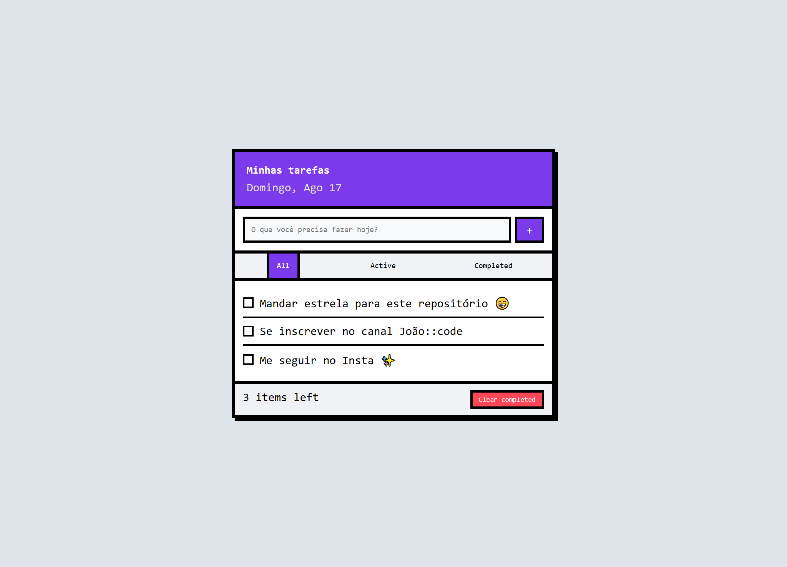

<h1 align="center">📝 TO-DO RETRÔ 📝</h1>

###



<h4 align="center"><a href="https://joao-enrique.github.io/to-do-website/">Confira o projeto aqui</a></h4>

👾 Bem-vindo ao **To-Do Retrô** — uma aplicação simples e prática para organizar suas tarefas, com aquele charme nostálgico em **pixel art**. 🚀  

###

<h2 align="left">🕹️ Funcionalidades</h2>

###
- ✅ Adicione novas tarefas facilmente  
- ✅ Marque tarefas como concluídas  
- ✅ Exclua tarefas da lista  
- ✅ Design retrô em pixel art  
- ✅ Totalmente responsivo  

###

<h2 align="left">🧠 Como funciona?</h2>

###
1. Digite a tarefa no campo de entrada.  
2. Clique em **Adicionar** para salvar a tarefa.  
3. Marque como concluída ao terminar.  
4. Exclua quando não precisar mais dela.  

Simples, rápido e no estilo retrô 🎨  

###

<h1 align="left">💾 Tecnologias utilizadas</h1>

###
<div align="left">
  
  
  
  
  
</div>

###

<h1 align="left">🧪 Como rodar?</h1>

###
<p align="left">1. Faça o clone do projeto:</p>

```bash

https://github.com/joao-enrique/to-do-website.git

```

<p align="left">2. Abra o <code>index.html</code> em seu navegador.</p>
<h1 align="left">👨‍💻 Estrutura</h1>

📁 todo-retro<br>
├── index.html # Estrutura principal<br>
├── style.css # Visual retrô/pixel art<br>
├── script.js # Lógica das tarefas<br>
└── README.md # Você está aqui!

<h1 align="left">🔮 Futuras melhorias</h1>

Armazenar tarefas no localStorage 💾

Filtros (todas, concluídas, pendentes) 🔎

Edição de tarefas ✏️

Animações em 8-bit 🎮

<h1 align="left">📬 Contato</h1> <p align="left">Feito com ❤️ por João Enrique.</p> <div align="left"> <a href="https://www.instagram.com/joao__dev/" target="_blank">  </a> <a href="https://www.linkedin.com/in/joao-enrique-dev/" target="_blank">  </a> <a href="https://www.youtube.com/@joao__dev" target="_blank">  </a> </div>

> “Organize suas tarefas como se estivesse gerenciando uma missão de RPG retrô.” – Pixel Tasks